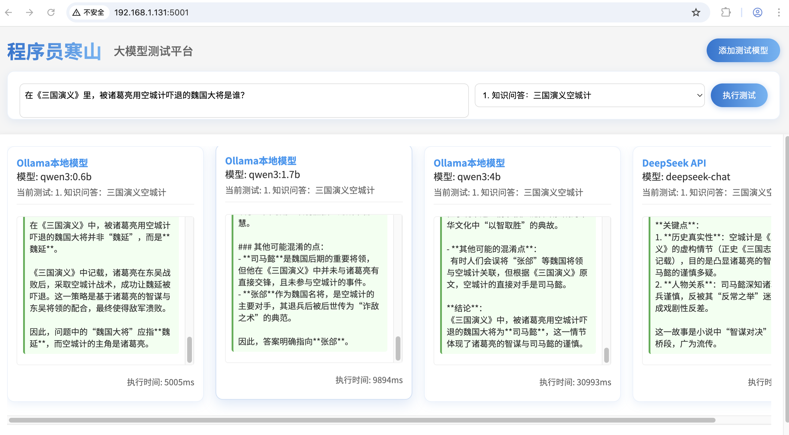

# 大模型对比测试平台



## 项目简介

这是一个用于对比测试不同大语言模型(LLM)性能的工具平台，支持DeepSeek API和Ollama本地模型。通过预设测试用例或自定义输入，可以直观比较不同模型的响应速度、回答质量等指标。

## 功能特点

- **多模型支持**: DeepSeek API, Ollama本地模型
- **预设测试用例**: 10种常见测试场景
- **流式响应**: 实时显示模型输出
- **并行测试**: 同时测试多个模型
- **性能指标**: 显示响应时间和资源占用
- **现代化界面**: 直观的卡片式布局

## 系统要求

- Python 3.8+
- Node.js 14+
- Ollama (如需测试本地模型)
- DeepSeek API Key (如需测试DeepSeek)

## 安装与运行

1. 克隆仓库:
```bash
git clone https://github.com/your-repo/multi_models_compare_test.git
cd multi_models_compare_test
```

2. 安装依赖:
```bash
pip install -r requirements.txt
```

3. 配置DeepSeek API Key:
编辑config.ini文件，添加您的API Key:
```ini
[deepseek]
api_key = your_api_key_here
model = deepseek-chat
```

4. 启动服务:
```bash
python server.py
```

5. 打开浏览器访问:
```
http://localhost:5001
```

## 配置说明

### DeepSeek配置
1. 获取API Key: 访问 https://platform.deepseek.com/
2. 编辑config.ini文件:
```ini
[deepseek]
api_key = your_api_key_here
model = deepseek-chat
```

### Ollama配置
1. 安装Ollama: https://ollama.ai/
2. 下载模型:
```bash
ollama pull model_name
```
3. 在界面中选择模型

## API接口

- `GET /api/config/deepseek` - 获取DeepSeek配置
- `GET /api/ollama/models` - 获取Ollama模型列表
- `POST /api/chat` - 发送聊天请求

请求示例:
```json
{
  "input": "测试文本",
  "config": {
    "type": "ollama",
    "ollamaModel": "llama2"
  }
}
```

## 测试用例

1. 知识问答: 三国演义空城计
2. 逻辑推理: 谁在说谎
3. 语言理解: 画蛇添足成语
4. 句子生成: 春天开头句子
5. 代码生成: 快速排序算法
6. 翻译能力: 不到长城非好汉
7. 数学计算: 促销价格计算
8. 情感分析: 文本情感判断
9. 创意联想: 云朵的味道
10. 常识判断: 骆驼驼峰储水

## 许可证

MIT License
