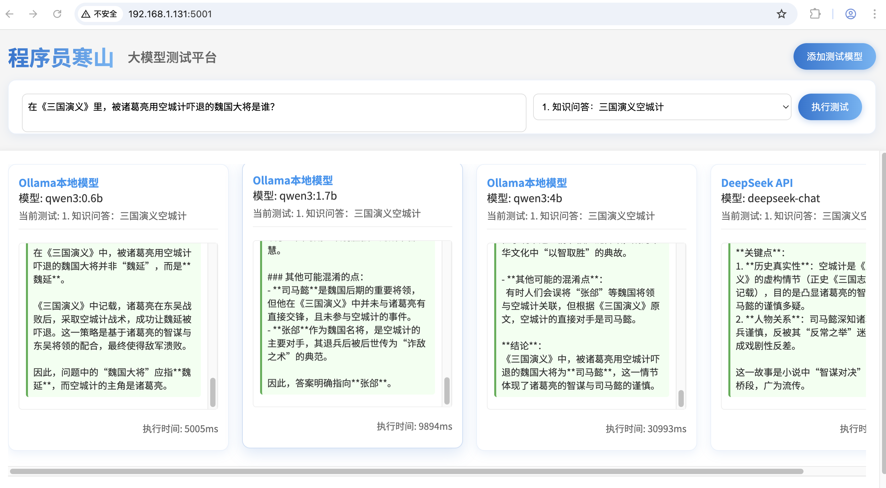

# Multi-Model Comparison Test Platform



## Project Introduction

This is a tool platform for comparing the performance of different large language models (LLMs), supporting DeepSeek API and Ollama local models. Through preset test cases or custom inputs, you can visually compare response speed, answer quality and other metrics of different models.

## Features

- **Multi-model support**: DeepSeek API, Ollama local models
- **Preset test cases**: 10 common test scenarios
- **Streaming response**: Real-time model output display
- **Parallel testing**: Test multiple models simultaneously
- **Performance metrics**: Show response time and resource usage
- **Modern UI**: Intuitive card-based layout

## Change History

### 2025/5/7
- Added author information and functionality documentation to all major code files
  - server.py: Backend service documentation
  - script.js: Frontend implementation documentation
  - styles.css: Style layout documentation
  - index.html: Main page functionality documentation

### 2025/5/1
- Initial version release
  - Implemented basic multi-model comparison testing
  - Added support for DeepSeek API and Ollama local models
  - Included 10 preset test cases
  - Implemented streaming response and parallel testing

## Requirements

- Python 3.8+
- Node.js 14+
- Ollama (for local model testing)
- DeepSeek API Key (for DeepSeek testing)

## Installation & Running

1. Clone repository:
```bash
git clone https://github.com/HanShan006/multi_models_compare_test.git
cd multi_models_compare_test
```

2. Install dependencies:
```bash
pip install -r requirements.txt
```

3. Configure DeepSeek API Key:
Edit config.ini file and add your API Key:
```ini
[deepseek]
api_key = your_api_key_here
model = deepseek-chat
```

4. Start service:
```bash
python server.py
```

5. Open in browser:
```
http://localhost:5001
```

## Configuration

### DeepSeek Configuration
1. Get API Key: Visit https://platform.deepseek.com/
2. Edit config.ini file:
```ini
[deepseek]
api_key = your_api_key_here
model = deepseek-chat
```

### Ollama Configuration
1. Install Ollama: https://ollama.ai/
2. Download model:
```bash
ollama pull model_name
```
3. Select model in UI

## API Endpoints

- `GET /api/config/deepseek` - Get DeepSeek configuration
- `GET /api/ollama/models` - Get Ollama model list
- `POST /api/chat` - Send chat request

Example request:
```json
{
  "input": "Test text",
  "config": {
    "type": "ollama",
    "ollamaModel": "llama2"
  }
}
```

## Test Cases

1. Knowledge Q&A: Empty Fort Strategy in Romance of Three Kingdoms
2. Logical reasoning: Who is lying
3. Language understanding: Meaning of idiom "Draw legs on a snake"
4. Sentence generation: Sentences starting with "Spring"
5. Code generation: Quick sort algorithm
6. Translation ability: "He who has never been to the Great Wall is not a true man"
7. Math calculation: Promotion price calculation
8. Sentiment analysis: Text sentiment judgment
9. Creative association: Taste of clouds
10. Common sense: Do camel humps store water?

## License

MIT License
